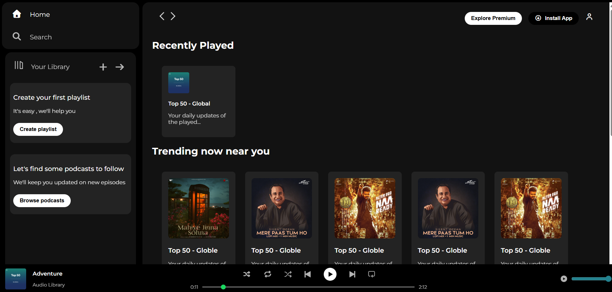
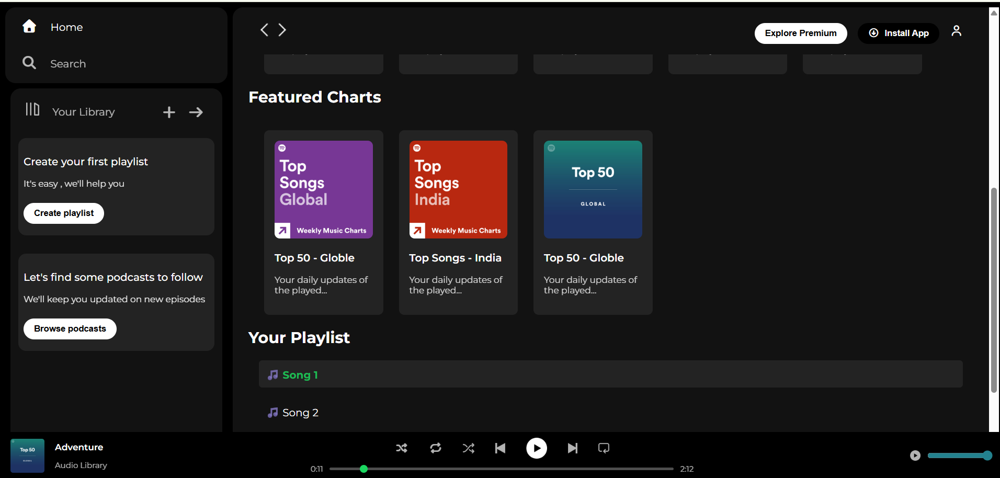

# 🎵 Spotify Clone

A responsive Spotify-inspired music player built using HTML, CSS, and JavaScript. This project recreates the look and feel of Spotify's web player while providing core music playback functionality with an interactive and user-friendly interface.

## 🚀 Live Demo

🔗 https://spotify-clone-4qd51b17w-shipra830s-projects.vercel.app

## 📌 Features

- Spotify-inspired modern user interface
- Play and pause music functionality
- Interactive music cards and playlists
- Dynamic song playback controls
- Previous and next track navigation
- Real-time music player section
- Responsive layout for different screen sizes
- Smooth user experience with JavaScript DOM manipulation

## 🛠️ Technologies Used

- HTML5
- CSS3
- JavaScript (ES6)
- Font Awesome
- Vercel (Deployment)

## 📂 Project Structure

```bash
Spotify-Clone/
│
├── assets/
│   ├── logo.png
│   ├── backward_icon.png
│   ├── forward_icon.png
│   ├── library_icon.png
│   ├── pause_icon.png
│   ├── play_musicbar.png
│   ├── card1img.jpeg
│   ├── card2img.jpeg
│   ├── card3img.jpeg
│   ├── card4img.jpeg
│   ├── card5img.jpeg
│   ├── card6img.jpeg
│   ├── player_icon1.png
│   ├── player_icon2.png
│   ├── player_icon3.png
│   ├── player_icon4.png
│   ├── player_icon5.png
│   ├── song1.mp3
│   ├── song2.mp3
│   └── song3.mp3
│
├── index.html
├── style.css
└── app.js
```

## 🎯 Learning Outcomes

Through this project, I gained practical experience in:

- DOM Manipulation
- Event Handling
- Audio Playback Integration
- Responsive Web Design
- JavaScript Logic Building
- Frontend Development Best Practices
- Project Deployment using Vercel
## 📸 Screenshots

### Homepage



### Music Player



## 🔮 Future Enhancements

- Volume control functionality
- Search feature for songs
- Shuffle and repeat options
- Dynamic playlist management
- Backend integration for music data
- User authentication system

## 👩‍💻 Author

**Shipra Pareek**

### Connect With Me

- GitHub: https://github.com/shipra830
- Portfolio: https://shipra-portfolio.vercel.app

## ⭐ Support

If you found this project useful, consider giving it a star on GitHub.
